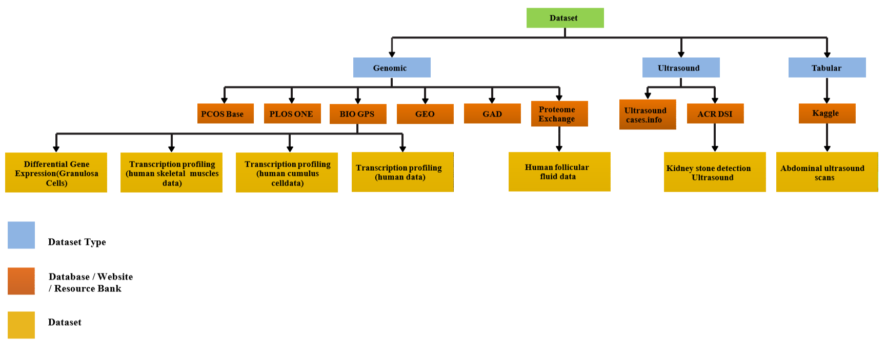
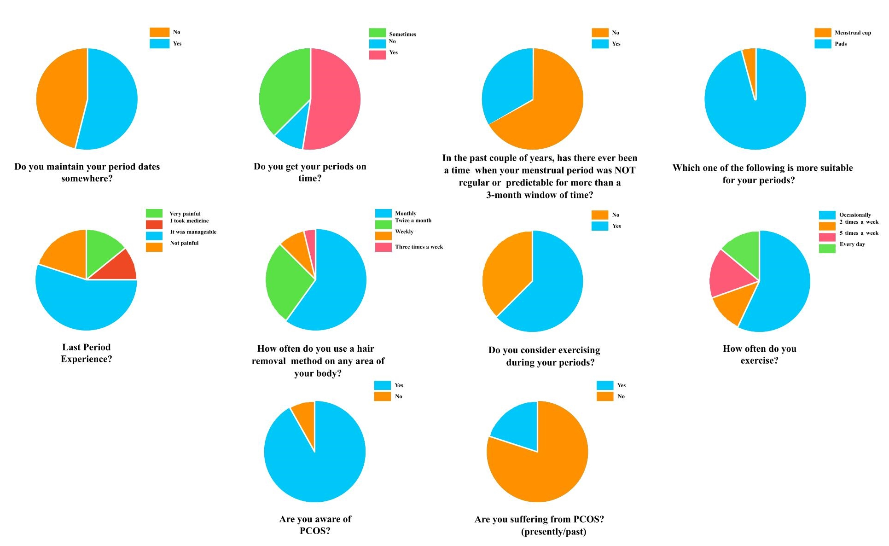

# Datasets and Codes of the PCOSGen: Tabular Dataset

This README contains information about various datasets related to Polycystic Ovary Syndrome (PCOS) research. The datasets span different types, including genomic, proteomic, and imaging data.

### Dataset Description

The datasets within the [table](#10076750) are diverse and focused on genomic, proteomic, and imaging data, offering comprehensive coverage for PCOS research. The genomic datasets include gene expression profiles, SNP data, and RNA sequencing, which are key to understanding the genetic basis of PCOS. Proteomic data focuses on protein levels and functional pathways altered in PCOS. Imaging datasets, particularly ultrasound images, are crucial for diagnosing and studying the morphological features of PCOS in clinical settings.

These datasets have been collected from various sources such as DRYAD, Proteome, and Array Express. They are accompanied by relevant metadata, including patient information, year of collection, and the size of the dataset, providing a rich resource for computational analysis, machine learning, and bioinformatics studies in PCOS. The data is classified by availability, where some are freely accessible while others require permissions or logins.

| S.No | Availability | Type | Source | Year | Size | Patients | Technology | Reference |
|:----:|:-------------|:-----|:-------|:----:|:-----|:---------|:-----------|:----------|
| 1 | ✅ Freely Available | Genomic | DRYAD | 2020 | 332KB | 44 | - | [Díaz et al.](#diaz2020low) |
| 2 | 🔒 Private | Proteome | Proteome | 2019 | 4129MB | - | TMT based quantitative Proteomic Study | [Wu](#Proteome41) |
| 3 | ✅ Freely Available | Genomic | Website | 2017 | 26.7MB | - | - | [Afiqah-Aleng et al.](#afiqah2017pcosbase) |
| 4 | ✅ Freely Available | Genomics | Science Direct | 2016 | 1594KB | - | Phylogenetic Analysis, Microarray data | [Panda et al.](#panda2016genetics) |
| 5 | ✅ Freely Available | Genomic | Array Express | 2014 | 9.3MB | 29 | Gene Set Enrichment Analysis, GenMAPP | [BioGPS](#DatasetB37) |
| 6 | ✅ Freely Available | Genomic | Array Express | 2014 | 4.7MB | 10 | Transcription profiling by array | [BioGPS](#DatasetB39) |
| 7 | ✅ Freely Available | Genomic | Array Express | 2014 | 6.6MB | 23 | Genome-wide oligonucleotide microarray | [BioGPS](#DatasetB54) |
| 8 | ✅ Freely Available | Genomic | Array Express | 2014 | 21MB | 43 | Pioglitazone therapy | [BioGPS](#DatasetB79) |
| 9 | ✅ Freely Available | Genomic | PLoS One | 2008 | 141MB | 23 | Pioglitazone therapy, RNA Extraction | [Skov et al.](#skov2008pioglitazone) |
| 10 | ✅ Freely Available | Genomic | Maayan Lab | 2004 | 116KB | - | - | [GAD](#gadpdf63) |
| 11 | 🔑 Free but Login Required | Images | Website | 2004 | - | - | Ultrasound | [Ultrasound Cases](#3Gynaeco22) |
| 12 | 🔑 Free but Login Required | Images | Kaggle | 2020 | 2GB | 1543 | Ultrasound Scans | [Orlando](#USsimula1) |
| 13 | ✅ Freely Available | Categorical | Website | - | - | - | Retroperitoneal ultrasound | [RadElement](#HomeRadE76) |

#### Study on miRNA Profile in PCOS

Diaz *et al.* have observed the baseline miRNA profile of girls suffering from PCOS and analyzed the effects of a randomized treatment with spironolactone-pioglitazone-metformin for a duration of 1 year or with an oral contraceptive (OC). They assessed miRNA profiles using RNA sequencing in girls with PCOS who participated in a random, open-label pilot study. A total of 31 girls with PCOS, aged 15.7 years and BMI 23.1 kg/m², participated, along with 13 healthy women of the same age and BMI as controls. Differentially expressed miRNAs were validated using qRT-PCR in the dataset. Post-treatment ovulation rates were evaluated by salivary progesterone in girls with PCOS. This study was performed in the Endocrinology Department, University Hospital. The study concluded that SPIOMET treatment for 1 year can normalize the miRNA profile of girls suffering from PCOS, and circulating miR-451a may serve as a biomarker for detecting PCOS in puberty. The authors have open-sourced the data [here](#diaz2020low).

#### Quantitative Proteomic Study

A TMT-based quantitative proteomic study was conducted on lean and obese women with PCOS and healthy controls by Mengwei Wu. In this study, they compared the composition of proteins, pathways, and molecular functions of follicular fluid (FF) from both categories of women.

#### PCOS Base Repository

[PCOS Base](#afiqah2017pcosbase) is a knowledge-based repository established to systematically store all proteins associated with PCOS. The collection of proteins was sourced from several online databases and published studies. Rigorous criteria were developed to identify proteins closely linked to PCOS. These proteins were analyzed for pathways, tissue localizations, and gene ontology, as well as associated diseases. Currently, 8,185 PCOS-related proteins have been identified, assigned to 13,237 gene ontology vocabularies, 1,004 pathways, 7,936 domains, 29 disease classes, 1,928 diseases, 91 tissues, and 320,472 interactions. All PCOS-related publications are indexed in this repository.

#### Transcription Profiling of Human Skeletal Muscle

A dataset has been released related to transcription profiling of human skeletal muscle in women with PCOS. The HG-U133 Plus 2.0 expression array from Affymetrix was used to analyze gene expression in skeletal muscle from 16 insulin-resistant women of reproductive age with PCOS, matched to 13 healthy women. Biological pathway analysis using GSEA 1.0 and GenMAPP 2.0 was performed to identify the significance of insulin resistance pathogenesis in PCOS. According to the biological relevance, the expression of 9 genes was selected and examined by q-RT-PCR. PCOS women were identified by fasting hyperinsulinemia and impaired insulin-stimulated glucose disposal, which was due to reduced glucose oxidation and storage, as well as impaired suppression of lipid oxidation (all P < 0.01). Both GSEA and GenMAPP revealed that OXPHOS was the most down-regulated biological pathway (P < 0.01). Results were confirmed by q-RT-PCR of six genes from the OXPHOS gene set and three transcription factors known to regulate their transcription. These findings suggest that insulin resistance and impaired mitochondrial oxidative metabolism are connected in skeletal muscle in women with PCOS, potentially contributing to the increased risk of type 2 diabetes. This dataset can be accessed [here](#DatasetB37).

#### Differential Gene Expression in Granulosa Cells

A dataset related to differential gene expression in granulosa cells from women with and without insulin resistance has been released. Data was collected from normal and PCOS women undergoing IVF. The microarray data from their granulosa cells was utilized for network construction. Normal and PCOS women undergoing IVF had their human granulosa cells separated from ovarian aspirates, with RNA extracted and hybridized to an Affymetrix GeneChip. The authors have open-sourced the data [here](#DatasetB39).

#### Transcription Profiling of Human Cumulus Cells

Transcription profiling by array of human cumulus cells was conducted at a University hospital on 25 patients undergoing IVF-ICSI treatment. Gene expression patterns of cultured human cumulus cells from IVF patients were studied using genome-wide oligonucleotide microarray technology. IVF patients were segregated into four categories based on whether they suffered from PCOS and their BMI, further divided into lean and obese. Genes expression comparison among lean PCOS, obese PCOS, lean controls, and obese controls was conducted. Cumulus cells were obtained from women undergoing IVF/ICSI, and after oocyte retrieval, RNA was extracted and Affymetrix microarrays were hybridized. The expression profile for all four categories was compared. Access the dataset [here](#DatasetB54).

#### Transcription Profiling After Pioglitazone Therapy

A dataset related to transcription profiling of human skeletal muscle after pioglitazone therapy was released. Two categories of women participated in the study to analyze the outcomes of pioglitazone therapy. The first category included 10 obese women with PCOS, compared with 13 non-PCOS women. This study indicated that pioglitazone therapy restores insulin sensitivity partially by a systematic increase of genes involved in mitochondrial oxidative metabolism and protein biosynthesis in skeletal muscle. The transcriptional effects of pioglitazone therapy may help in preventing the onset of type 2 diabetes in these women. Access this dataset [here](#DatasetB79).

#### Genetic Data from Pioglitazone Therapy Patients

A dataset has been made available on gene expression profiling in peripheral blood mononuclear cells (PBMCs) from women with PCOS. PBMCs were collected at baseline and after treatment with pioglitazone. A total of 23 participants were selected for the study, with pioglitazone used as a treatment in all participants. Pioglitazone-induced insulin sensitivity and its connection with increased mitochondrial oxidative metabolism were studied. Access the dataset [here](#skov2008pioglitazone).

### Study Design and Data Collection Methodology

A research [survey](#10064817) was conducted to investigate menstrual cycles and hygiene among women from various geographical regions across India, focusing on different age groups. Utilizing Google Forms and Google Sheets, data collection occurred over two weeks from October 7 to October 20, 2021. The survey was designed to gather personal information while ensuring participant anonymity. It included questions about menstrual cycles, lifestyle factors, and hygiene practices, allowing participants to skip questions they preferred not to answer. A data cleaning method was employed to ensure the integrity of the dataset by omitting misunderstood or incorrect responses.

The survey included 242 women aged 18 to 45 years, where key findings indicated that 128 participants had regular periods, 24 experienced irregular cycles, and 90 faced irregularity due to stress and lifestyle changes. Among these women, 47 had PCOS, while 191 were considered healthy. The average menstrual cycle for women with PCOS was 5-6 days compared to 4 days for healthy women, and the average age for menarche was approximately 13 years. Furthermore, 54.4% of participants actively tracked their cycles, demonstrating varying levels of awareness regarding menstrual health and PCOS, with 91.3% of women having some knowledge about the condition.

The survey also addressed menstrual hygiene, essential for preventing infections. It was found that 95% of participants preferred sanitary pads, despite known health risks and environmental concerns, while only 4.5% opted for menstrual cups. Additionally, the research highlighted the correlation between PCOS and weight, with 30-60% of women suffering from obesity, exacerbating their symptoms. The dataset created from this survey can serve as a valuable resource for future research, aiding in the development of predictive applications for menstrual cycle tracking and improving awareness and management of menstrual health among women and healthcare providers.

### References

1. [Machine learning approaches in medical image analysis of PCOS](https://doi.org/10.1109/MLCSS57186.2022.00017)  
   Jan, Naila; Makhdoomi, Anaa; Handa, Palak; Goel, Nidhi. In *2022 International Conference on Machine Learning, Computer Systems and Security (MLCSS)*, pages 48-52, 2022.

2. [Machine learning techniques for medical images in PCOS](https://doi.org/10.1109/AIST55798.2022.10064817)  
   Makhdoomi, Anaa; Jan, Naila; Palak, Palak; Goel, Nidhi. In *2022 4th International Conference on Artificial Intelligence and Speech Technology (AIST)*, pages 1-6, 2022.

3. Díaz, M., et al. (2020). Low circulating levels of miR-451a in girls with polycystic ovary syndrome: different effects of randomized treatments. *The Journal of Clinical Endocrinology & Metabolism*, 105(3), e273-e281.

4. Wu, M. (2019). ProteomeXchange Dataset PXD013937. *Proteome Central*. [Link](http://proteomecentral.proteomexchange.org/cgi/GetDataset?ID=PXD013937)

5. Afiqah-Aleng, N., et al. (2017). PCOSBase: a manually curated database of polycystic ovarian syndrome. *Database*, 2017.

6. Panda, P.K., et al. (2016). Genetics of PCOS: A systematic bioinformatics approach to unveil the proteins responsible for PCOS. *Genomics Data*, 8, 52-60.

7. BioGPS (2014). Dataset | BioGPS. [Link](http://biogps.org/dataset/E-GEOD-6798/)

8. BioGPS (2014). Dataset | BioGPS. [Link](http://biogps.org/dataset/E-GEOD-34526/)

9. BioGPS (2014). Dataset | BioGPS. [Link](http://biogps.org/dataset/E-GEOD-10946/)

10. BioGPS (2014). Dataset | BioGPS. [Link](http://biogps.org/dataset/E-GEOD-8157/transcription-profiling-of-human-skeletal-muscle-4/)

11. Skov, V., et al. (2008). Pioglitazone enhances mitochondrial biogenesis and ribosomal protein biosynthesis in skeletal muscle in polycystic ovary syndrome. *PLOS One*, 3(6), e2466.

12. GAD (2004). gad.pdf. [Link](https://geneticassociationdb.nih.gov/gad.pdf)

13. Ultrasound Cases (2004). 3 Gynaecology | Ultrasound Cases. [Link](https://www.ultrasoundcases.info/cases/gynaecology/)

14. Orlando, I. (2020). US simulation & segmentation | Kaggle. [Link](https://www.kaggle.com/ignaciorlando/ussimandsegm)

15. RadElement (2020). Home | RadElement. [Link](https://www.radelement.org/home/sets/set/RDES158)